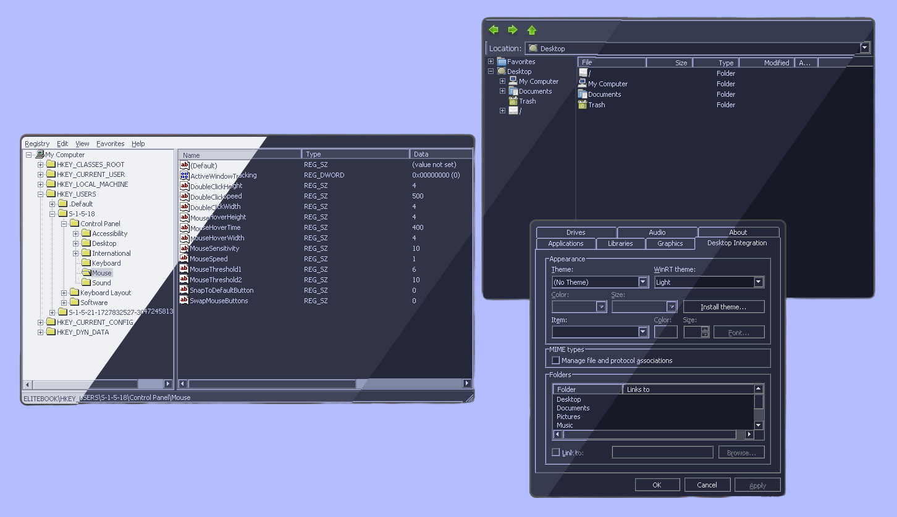
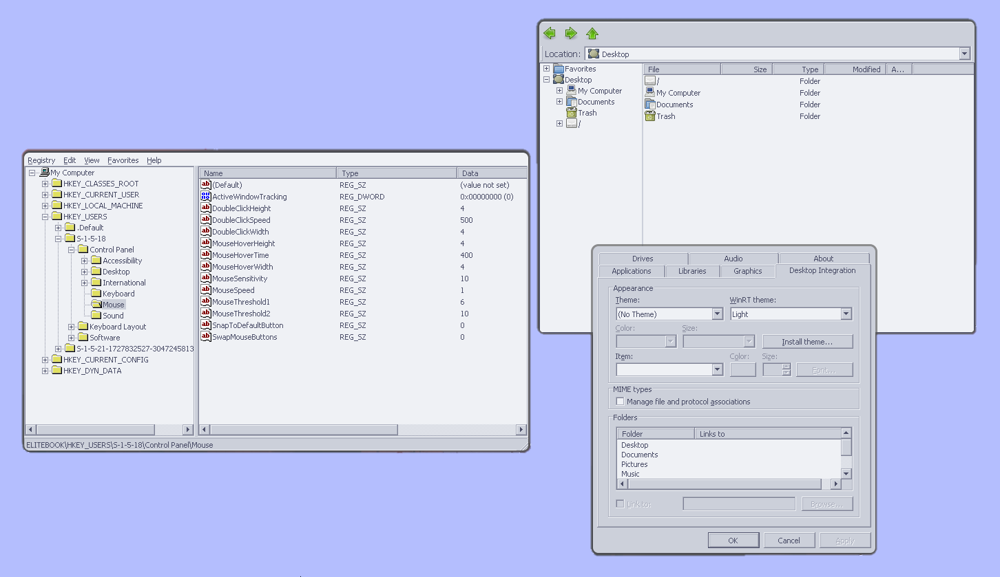
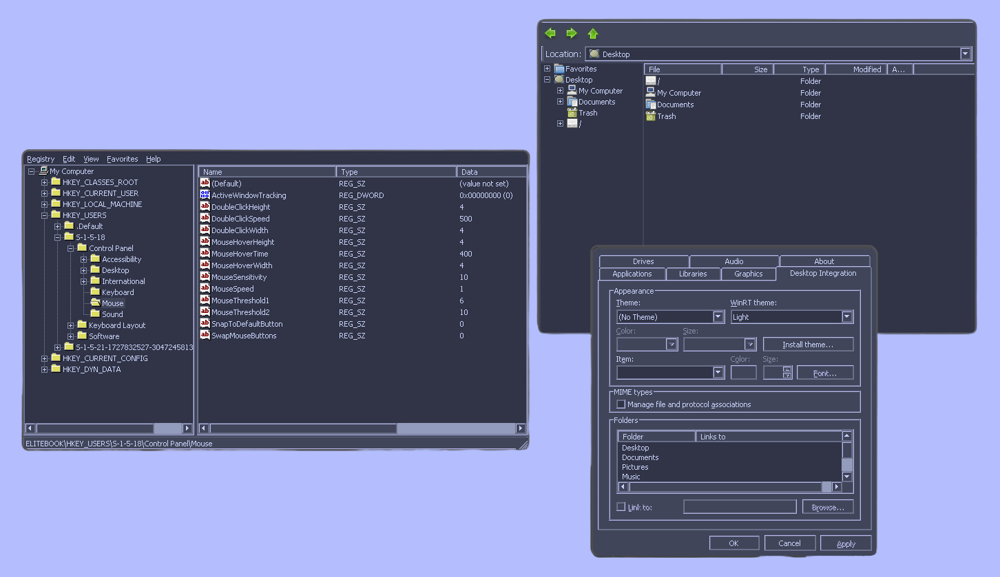
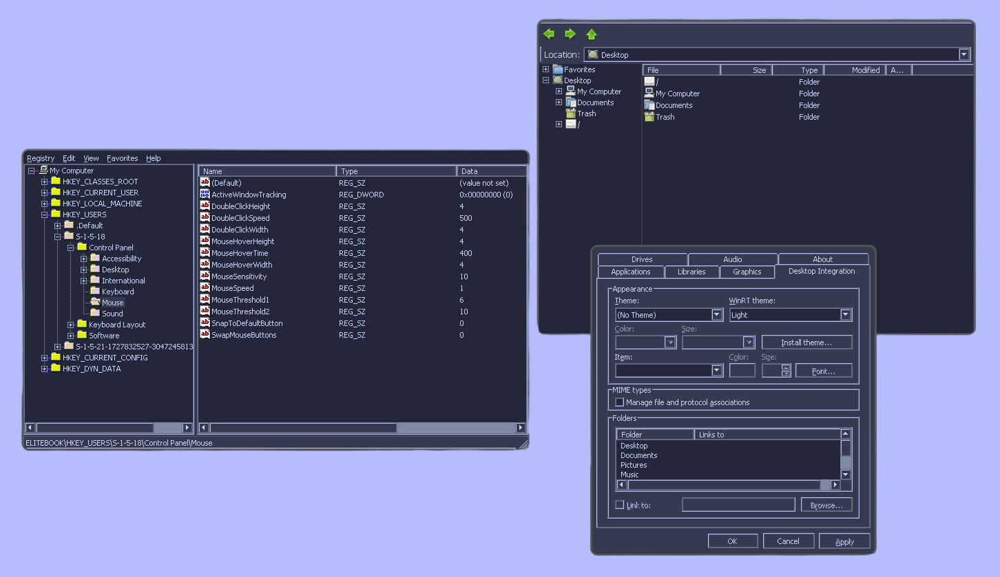
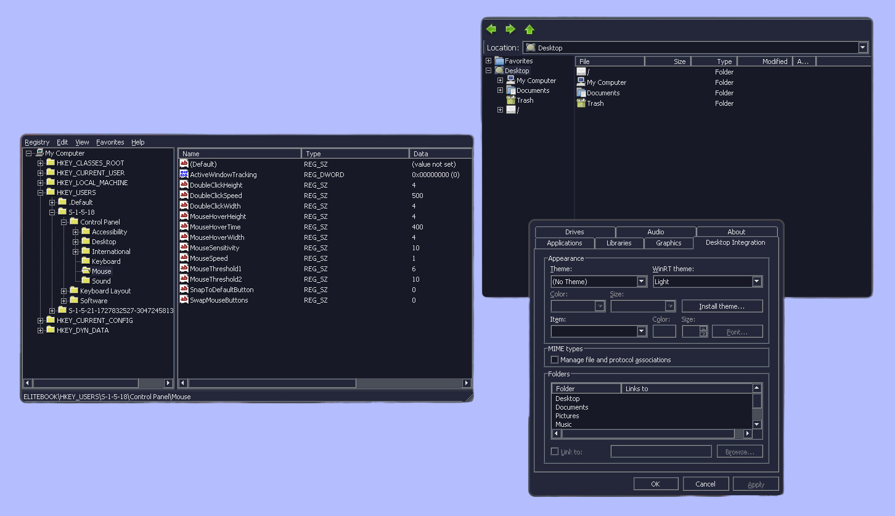

<h3 align="center">
	<br/>
	
	Catppuccin Colors for <a href="https://www.winehq.org/">Wine</a>
	
</h3>

<p align="center">
    <a href="https://github.com/AhmedSahbaoui69/catppuccin-wine-colors/stargazers"></a>
</p>

<p align="center">
  
</p>

## Overview  

This repo provides Catppuccin-themed color schemes for the **Wine** ecosystem.  

This is achieved by modifying `[HKEY_CURRENT_USER\Control Panel\Colors]` in the Windows Registry to match [Latte](#latte) 🌻, [Frappé](#frappe) 🪴, [Macchiato](#macchiato) 🌺, and [Mocha](#mocha) 🌿 palettes for a more *soothing* look.  

## Previews  

<details id="latte">  
<summary><a href="#latte">🌻 Latte</a></summary>  
  
</details>  

<details id="frappe">  
<summary><a href="#frappe">🪴 Frappé</a></summary>  
  
</details>  

<details id="macchiato">  
<summary><a href="#macchiato">🌺 Macchiato</a></summary>  
  
</details>  

<details id="mocha">  
<summary><a href="#mocha">🌿 Mocha</a></summary>  
  
</details>

## Installation

Navigate to your Wine prefix and run the `regedit` command as follows:

```
regedit /path/to/Mocha.reg
```

## License

This project is licensed under the [MIT License](LICENSE).